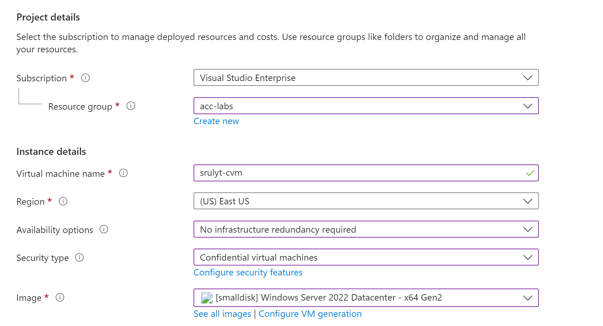
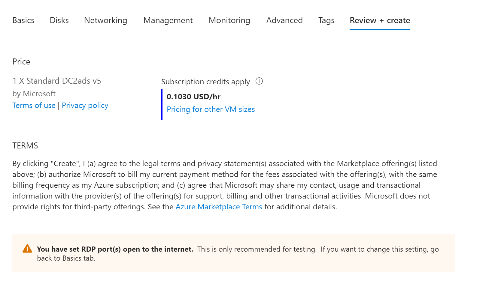
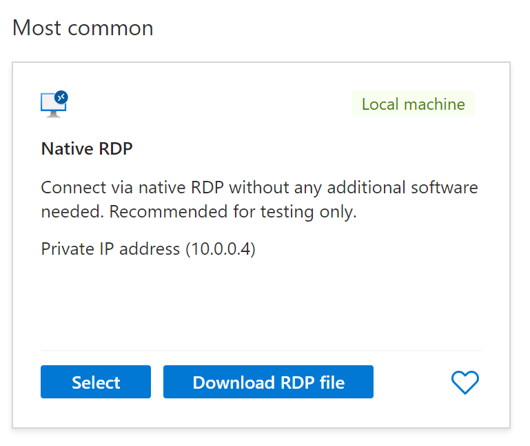

# Lab 2 - Create a confidential virtual machine in the portal (20 mins)

In this lab, you will create a Confidential Virtual Machine (CVM) in the Azure Portal and verify its successful creation. 

> __Note:__
> For today's labs you will be using your Visual Studio Enterprise Subscription as part of the FTE benefit

> __Note:__
> As you progress through the labs, frequently you will see instructions indicating "**+ Add, + Create, + New**". Be aware that various places in the Azure portal use **Add** *or* **Create** *or* **New** when you are creating / deploying a new resource. For convenience,  lab steps mention all three though you will most often find only one of them in the portal for any given step.

## Task 1: Create the virtual machine 

1. Sign in to the Azure portal: **https://portal.azure.com**

2. In the **Search services and marketplace** text entry field, search for and select **Virtual machines**, and then click **+Add, +Create, +New** and choose **Azure virtual machine** from the drop down.

> __Note:__
> You will also typically find the **Virtual Machine** resource on the list of Popular Azure services found on the **Create a resource** pane.

3. On the **Basics** tab, fill in the following information (leave the defaults for everything else):

    - **Subscription:** - **Visual Studio Enterprise Subscription**
    - **Resource group:** - Use the resource group you created in the previous lab
    - **Virtual machine name:**  - **<alias>-cvm**
    - **Region:** - **(US) East US**
    - **Availability options:**  - No infrastructure redundancy required
    - **Security type** - **Confidential Virtual Machines**
    - **Image:**  - **[small disk] Windows Server 2022 Datacenter - x64 Gen2**
    - **Size:**  - **Standard_DC2ads_v5 - 2 vcpus, 8 GiB memory**
    - **Administrator account username:** - **azureuser** 
    - **Administrator account password (type in carefully!):**  - **Demo@Pass1234**
    - **Public inbound ports:**  - Select the **Allow Selected Ports** radio button. 
    - **Select inbound ports** RDP (3389)

9. Switch to the **Management** tab.
1. In the **Auto-shutdown** section, select the **Enable auto-shutdown** check box, choose your local **Time zone**  and deselect the **Notification before shutdown** box.

1. Switch to the **Monitoring** tab and ensure that **Boot diagnostics:**  is set to **Disable**.

1. Leave the remaining values on the defaults and then click the **Review + create** button at the bottom of the page.

1. Once validation has passed click the **Create** button. It will take several minutes to deploy the virtual machine.

1. You will receive updates on the deployment page and via the **Notifications** area (the bell icon in the top menu bar).

## Task 2: Confirm successful deployment of the Virtual Machine

In this task, you will confirm that our new Virtual Machine was successfully deployed.

1. Click on the bell icon from the upper blue toolbar, and select 'Go to resource' when your deployment has succeeded.

    > __Note:__  You can also use the **Go to resource** link on the deployment page when deployment is complete

2. On the virtual machine **Overview** blade, confirm that the status indicates **Running**.

## Task 3: Connect to the virtual machine remotely

> __Note:__ This section of the lab will only function if you are using your personal FTE provided Azure subscription. As a part of the zero-trust policy at Microsoft, incoming connection requests, are not permitted for non-production subscriptions. As a result, this section will not work with the Microsoft Corporate subscriptions.

1. While still on your VM page in the Azure portal, locate and select **Connect** under the **Connect** section in the left nav pane.
1. Click the **Download RDP file** button.

1. Run the downloaded RDP file on your local machine
1. Click **Connect**
1. Enter the username and password you used when creating the CVM
1. Sign in to the CVM

You now have access to a conidential virtual machine. You will notice that it looks and feels like any other Windows Server VM. This allows users to lift and shift workloads onto confidential hardware with ease.